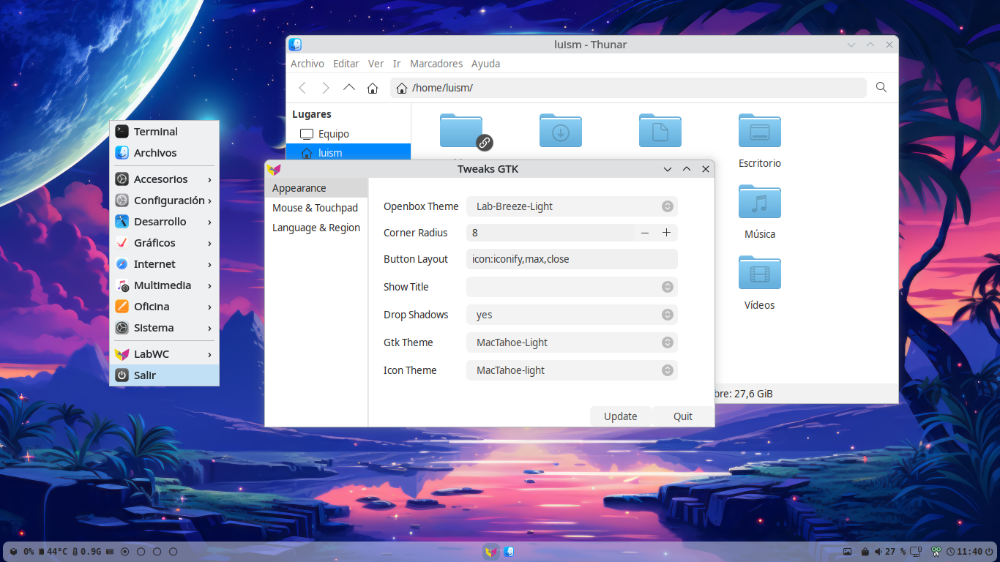

## LabWC Themes
Some of my themes for LabWC.

**Aqua 7**

**Aqua Dark**

**Aqua Dots**

**Aqua Gradient**

**Aqua Pills**

**Arc Dark**

**Arc Light**

**Bluelook**

**Breeze Dark**

**Breeze Light**

**Edna**

**Liquid Dark**

**Liquid Glass**

**MascOS Leopard**

**MacOS Lion**

**Oxygen**

**W7**

**W11 Silver**

**XP Royal**


**Installation:**

Open a Terminal emulator and download the files.

```
git clone https://github.com/Jolmas/LabWC.git

cd LabWC

chmod +x install.sh

./install.sh

```

